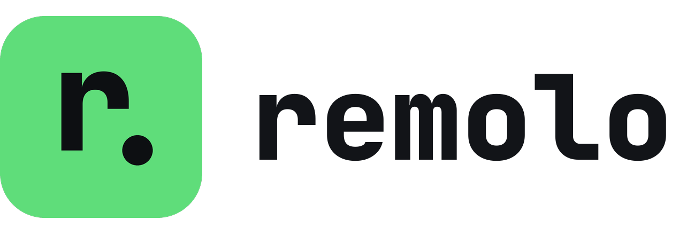

<div align="center">
  <picture>
    <source media="(prefers-color-scheme: dark)" srcset="brand/logo-dark.png">
    
  </picture>
  <p>Get a shell, your files and the screen of another machine by pasting one token. Works behind NAT.</p>
</div>

---

On the machine you want to reach:

```console
$ remolo host
remolo host active, listening on UDP port 49213

Session token:
   REMOLO1-MR0G20-JR430T-XCD75X-1YFVSH-...-0EBP8N-KC

Share this token. It expires in 24h0m0s. (use --ttl to change)
```

On yours:

```console
$ remolo connect REMOLO1-MR0G20-...-KC
remolo: resolving host... [direct 10.0.0.42:49213, RTT 0.4ms] connected
host:~$ _
```

That is the whole setup. No account, VPN, port forwarding, configuration file, public IP, or
server installation is required.

## Commands

- `remolo connect <token>` opens an interactive shell. `--resume` survives network changes.
- `remolo exec <token> -- <cmd>` runs one command with its real exit code and stderr.
- `remolo put` and `remolo get` transfer files with resume and checksum verification.
- `remolo sync <token> <local> <remote>` transfers only changed file blocks.
- `remolo mount <token> <dir>` mounts the remote filesystem locally.
- `remolo forward <token> -L 8080:localhost:80` forwards TCP. `-D` opens a SOCKS5 proxy.
- `remolo desktop <token>` opens the remote screen, mouse, and keyboard in a browser.
- `remolo webterm <token>` opens a terminal in a browser.

Concurrent commands reuse the existing encrypted connection. Enrollment replaces copied tokens
with a persistent client key and a local alias. Groups run one command across several enrolled
hosts.

## Connection paths

Remolo races every address carried by the token and keeps the first authenticated connection. If a
direct path is unavailable, it tries local discovery, rendezvous, relay, an existing SSH server,
then an explicitly supplied endpoint. The selected path is always visible to the user.

`remolo-rendezvous` and `remolo-relay` are separate self-hosted binaries. The relay moves encrypted
bytes and cannot read session traffic.

## Security

Sessions use TLS 1.3 with the host key pinned from the connection token. A challenge-response proves
that the client holds the token secret. Tokens expire after 24 hours by default and can be
single-use, read-only, channel-scoped, command-scoped, rooted to one directory, or subject to local
approval.

Treat a connection token like a password. Remolo is for machines you own or have explicit consent
to control.

## License

Remolo is licensed under either the Apache License 2.0 or the MIT License, at your option.
